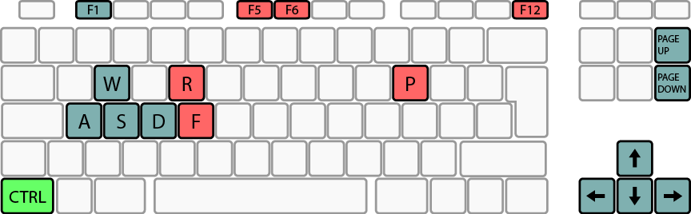

Getting Started
***************

.. note::

   If you have any questions, do not hesistate to contact me at ``lbpclabs(at)gmail(dot)com``.

.. todo::

   Installation instructions

Basic Usage
===========

.. warning::
   
   By using AutoFlight you agree that I'm not responsible for any damage you might cause to your AR.Drone while using this program. This is a pre-alpha version!

To start flying your AR.Drone, make sure you are already connected to it via WiFi, just like you would connect to any other wireless router. Then click `Connect to AR.Drone 2.0` in AutoFlight. If it doesn't work, make sure you are indeed connected to the drone, and click `Connect to AR.Drone 2.0` again. If it still doesn't work, contact me.

.. note:: 
   
   When connected you should see a "Sensor check" window, probably stating that there's a problem with your bottom camera. Ignore this, the test it performs to decide if it works or not is a crap. To be fixed as soon as possible.

You can configure your joystick over the "Edit > Controller Configuration" menu - it should be pretty straightforward. If you have questions don't hesistate to contact me. 
If you don't have a controller, you can fly with your keyboard, too. The next section shows how.

Flying with a Joystick / Gamepad / Keyboard
-------------------------------------------

Flying with a Joystick / Gamepad
++++++++++++++++++++++++++++++++

.. note::
   
   My gamepad and joysticks work flawlessy, but if yours does not, I've heard from users that `MotioninJoy <http://www.motioninjoy.com/>`_ can solve the problems.

Flying with the Keyboard
++++++++++++++++++++++++

No configuration is needed. Just use the commands described in the table below.

+-------------------------------------------+------------------------------+---------------------------------------------+-------------+
| AR.Drone Commands                                                        | AutoFlight Commands                                       |
+===========================================+==============================+=============================================+=============+
| Take Off                                  | CTRL + F5                    | Take Picture                                | CTRL + P    |
+-------------------------------------------+------------------------------+---------------------------------------------+-------------+
| Land                                      | CTRL + F6                    | Start/Stop recording                        | CTRL + R    |
+-------------------------------------------+------------------------------+---------------------------------------------+-------------+
| Flip                                      | CTRL + F                     | Toggle HUD                                  | F11         |
+-------------------------------------------+------------------------------+---------------------------------------------+-------------+
| Emergency                                 | CTRL + F12                   |                                                           |
+-------------------------------------------+------------------------------+---------------------------------------------+-------------+
| Up | Rotate left | Down | Rotate right    | UP|LEFT|DOWN|RIGHT           |                                                           |
+-------------------------------------------+------------------------------+---------------------------------------------+-------------+
| Forward | Left | Backward | Right         | W|A|S|D                      |                                                           |
+-------------------------------------------+------------------------------+---------------------------------------------+-------------+
| Increase speed | Decrease Speed           | PAGE UP | PAGE DOWN          |                                                           |
+-------------------------------------------+------------------------------+---------------------------------------------+-------------+

Miscellaneous
-------------

Photos/Video
++++++++++++

Photos and recorded videos are saved in your home folder, under a new folder called AR.Drone (e.g. in ``C:\Users\your_username\AR.Drone`` on Windows 7).

To change the resolution of the video stream from 360P to 720P, open the configuration editor (Tools > Configuration Editor) and set "Enable 720P HD video stream from ``false`` to ``true``. If you already connected to the AR.Drone, you'll have to restart AutoFlight for this change to take effect.

.. note::
   
   For the configuration editor to work you have to have saved the configuration at least one time (just let AutoFlight save your configuration on exit).

HUD
+++

Since version DEV61 AutoFlight features a nice head-up display (HUD), especially good for use in fullscreen mode. To show/hide it, press ``F1``. Be sure to check it out!

Arduino
+++++++

Some very basic functionality is already available! Check it out here: `Using Arduino Extensions with AutoFlight <http://www.lbpclabs.com/docs/autoflight/gettingstarted-arduino>`_

Other
+++++

For information on how to log sensor data, change the default IP AutoFlight tries to connect to and other more advanced things take a look at the following topics.

Something does not work / I found a bug
+++++++++++++++++++++++++++++++++++++++

Please create an issue on my `JIRA project tracker <https://lbpclabs.atlassian.net>`_. You just will have to sign up. Thank you!

